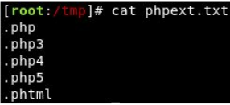
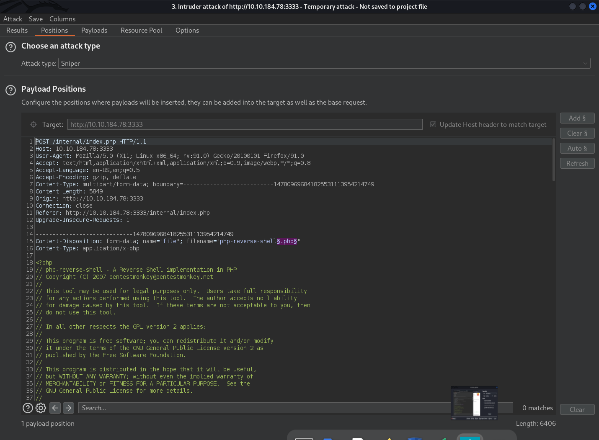

# Module: Vulnversity

Author: Jackson Warren  
Date: August 30, 2022  

## Reconnaissance

### Nmap Scan
`$ nmap -sV -oN scans/nmap-10.10.184.78.out 10.10.184.78`

Scan the box, how many ports are open?  
Answer: **6**

What version of the squid proxy is running on the machine?  
Answer: **3.5.12**

How many ports will nmap scan if the flag -p-400 was used?  
Answer: **400**

Using the nmap flag -n what will it not resolve?  
Answer: **DNS** (-n Never do DNS resolution)  

What is the most likely operating system this machine is running?  
Answer: **Ubuntu**

What port is the web server running on?  
Answer: **3333** Apache httpd 2.4.18 ((Ubuntu))

## Locating Directories Using GoBuster
Lets first start of by scanning the website to find any hidden directories. To do this, we're going to use GoBuster.  

GoBuster is a tool used to brute-force URIs (directories and files), DNS subdomains and virtual host names. For this machine, we will focus on using it to brute-force directories.  

Download GoBuster here, or if you're on Kali Linux 2020.1+ run `sudo apt-get install gobuster`  

To get started, you will need a wordlist for GoBuster (which will be used to quickly go through the wordlist to identify if there is a public directory available. If you are using Kali Linux you can find many wordlists under /usr/share/wordlists.  

Now lets run GoBuster with a wordlist:  
`gobuster dir -u http://<ip>:3333 -w <word list location>`

### Running my GoBuster
`gobuster dir -u http://10.10.184.78:3333 -w /usr/share/wordlists/dirbuster/directory-list-2.3-small.txt -o scans/goBuster-10.10.184.78:3333.out`

```
$ cat scans/goBuster-10.10.184.78:3333.out 
/images               (Status: 301) [Size: 320] [--> http://10.10.184.78:3333/images/]
/css                  (Status: 301) [Size: 317] [--> http://10.10.184.78:3333/css/]
/js                   (Status: 301) [Size: 316] [--> http://10.10.184.78:3333/js/]
/fonts                (Status: 301) [Size: 319] [--> http://10.10.184.78:3333/fonts/]
/internal             (Status: 301) [Size: 322] [--> http://10.10.184.78:3333/internal/]
```

What is the directory that has an upload form page?  
Answer: **/internal/**

## Compromise The Webserver
Now you have found a form to upload files, we can leverage this to upload and execute our payload that will lead to compromising the web server.  

What common file type, which you'd want to upload to exploit the server, is blocked? **Try a couple to find out.** 
Answer: **.php**

## Using Burp Suite Intruder
We're going to use Intruder (used for automating customised attacks).  
  
To begin, make a wordlist with the following extensions in:
  

Now make sure BurpSuite is configured to intercept all your browser traffic. Upload a file, once this request is captured, send it to the Intruder. Click on "Payloads" and select the "Sniper" attack type.  

Click the "Positions" tab now, find the filename and "Add §" to the extension. It should look like so:
  

Intruder didn't work (all results responded with 200) so we're just going to guess that it's .phtml  
Answer: **.phtml**


